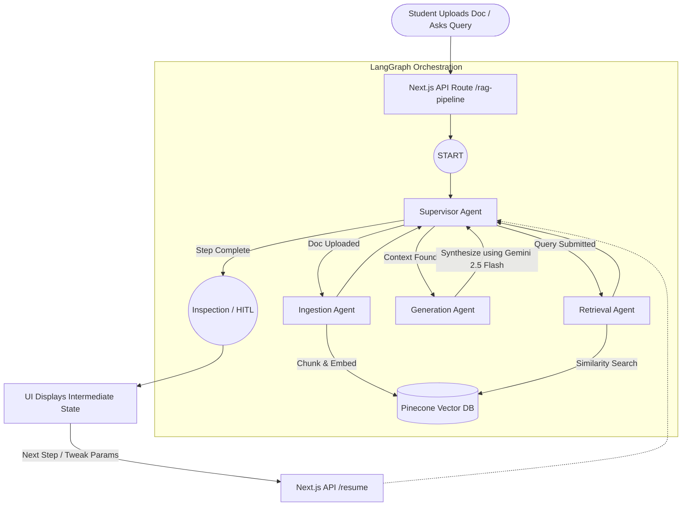

# Learn RAG: Architecture & Workflow Guide

> [!NOTE]
> This guide breaks down the technical architecture of an AI-powered Educational RAG (Retrieval-Augmented Generation) application, designed to teach students how to build and understand a RAG model from scratch.

## High-Level Architecture

The application is built on a modern, robust stack mirroring standard production environments:
- **Frontend**: Next.js 16 (App Router), React 19, Framer Motion for animations.
- **Styling**: Vanilla CSS with custom properties (`globals.css`)—no Tailwind, ensuring a bespoke, premium aesthetic.
- **Relational Database**: SQLite, managed through Prisma ORM (used for user authentication, profiles, and progress tracking).
- **Vector Database**: Pinecone (for storing and querying document embeddings).
- **Authentication**: NextAuth.js (Credentials Provider) with `bcryptjs`.
- **AI Orchestration**: `@langchain/langgraph` coupled with `@langchain/google-genai` (strictly utilizing **Gemini 2.5 Flash** for all generation and embedding tasks).

## RAG Educational Workflow (LangGraph)

This application doesn't just perform RAG; it breaks down the process into observable steps (nodes) using a **Multi-Agent System**. This allows students to pause the workflow and inspect exactly how documents are chunked, embedded, retrieved, and synthesized.

### 1. State Definition
LangGraph operates on a shared state. Our `GraphAnnotation` defines the schema for this state, tracking the student's inputs (uploaded documents, queries), intermediate data (chunks, embeddings, retrieved context), and the final generated output.

### 2. The Educational Nodes

#### The Supervisor (Router)
The `supervisorAgent` acts as a deterministic traffic controller. To save API quota and ensure predictable educational paths, **it does not use an LLM**. Instead, it checks the state graph programmatically to route the student through the RAG pipeline step-by-step.
- If a document is uploaded but lacks vectorization, it routes to the Ingestion Agent.
- If a query is submitted without context, it routes to the Retrieval Agent.
- If context is successfully retrieved, it routes to the Generation Agent.

#### The Ingestion Agent (Document Processing)
When a student uploads a document (e.g., PDF, TXT):
1. **Chunking**: The text is split into semantic chunks (e.g., using RecursiveCharacterTextSplitter).
2. **Embedding**: Each chunk is passed to **Gemini 2.5 Flash's embedding model** to generate numerical vector representations.
3. **Storage**: The vectors and their corresponding text chunks (metadata) are upserted into **Pinecone**.

#### The Retrieval Agent
When a student asks a question about the uploaded document:
1. The agent converts the user's string query into a vector using the same Gemini 2.5 Flash embedding model.
2. It performs a similarity search in **Pinecone** to find the top *k* most relevant chunks (e.g., via Cosine Similarity).
3. The retrieved chunks are appended to the LangGraph state as "Context".

#### The Generation Agent
Once the context is retrieved, the `generationAgent` takes over. It constructs a dynamic prompt combining the original user query with the retrieved Pinecone text chunks, feeding it into **Gemini 2.5 Flash** to synthesize a final, grounded answer.

### 3. Human-In-The-Loop (HITL) for Learning
To maximize educational value, the graph hits an `END` node mapped to an `inspectionMode` after each major step.
- The Next.js API returns the current state to the frontend.
- The UI presents the raw data (e.g., visualizing the numerical embeddings array or highlighting the exact text chunks retrieved).
- Students can interact, tweak retrieval parameters (like altering the *k* value or chunk size), and resume the graph to see how their changes affect the final AI response.

## Technical Workflow Diagram

## Optimizations for API Quotas

> [!IMPORTANT]
> The Agentic AI ecosystem imposes strict quotas on free tiers. Since we are exclusively using Gemini 2.5 Flash, we must manage requests efficiently.

This architecture implements several optimizations to prevent rate limiting:
1. **Deterministic Supervisor**: Routing logic is hardcoded rather than LLM-driven, saving multiple LLM calls per pipeline execution.
2. **Batch Embedding**: Document chunks are batched before being sent to the Gemini embedding API to minimize the number of outbound network requests.
3. **Single Generation Pass**: The `generationAgent` relies on exactly **1 LLM request** to compile the final answer, avoiding costly iterative self-refinement loops unless explicitly triggered by the student.
